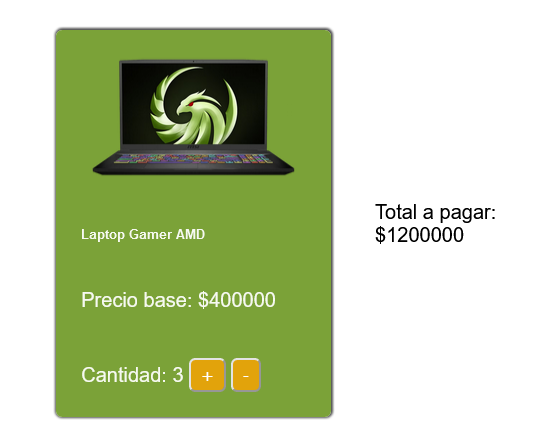

# Desafío 1 - Calculando el Total

Este proyecto consiste en la implementación de una tarjeta interactiva para un producto en una tienda online. Permite modificar la cantidad de productos y calcular el total a pagar.

## Descripción del Proyecto

La tarjeta del producto presenta la información básica, incluyendo el nombre del producto, el precio base y la cantidad seleccionada. Se han implementado botones de incremento y decremento para ajustar la cantidad de productos a comprar.

## Resultado Final

### Escritorio


## Experiencia del Desarrollo

Durante el desarrollo de este proyecto, se utilizaron las herramientas aprendidas para manipular el DOM, específicamente el método `querySelector`. Se aplicaron eventos de clic para los botones de incremento y decremento, actualizando dinámicamente la cantidad y el total a pagar.

## Código Destacado

```javascript
quantity = document.querySelector('.cantidad')
quantityNum = Number(quantity.innerHTML)

precio = 400000
precioSpan = document.querySelector(".precio-inicial");
precioSpan.innerHTML = precio

document.querySelector('#plus').addEventListener('click', function () {
    quantityNum += 1
    quantity.innerHTML = quantityNum
    totalAmount = document.querySelector('.valor-total')
    totalAmount.innerHTML = quantityNum * precio
})

document.querySelector('#minus').addEventListener('click', function () {
    if (quantityNum > 0) {
        quantityNum -= 1
        quantity.innerHTML = quantityNum
        totalAmount = document.querySelector('.valor-total')
        totalAmount.innerHTML = quantityNum * precio
    }
})
```

## Instrucciones de Uso

1. Abre el archivo `index.html` en tu navegador.
2. Interactúa con los botones "+" y "-" para ajustar la cantidad de productos.
3. Observa cómo se actualiza dinámicamente el total a pagar.

¡Gracias por revisar mi proyecto!
